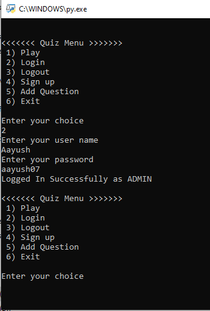

# Quiz-Application
Quiz Application with Python 3.7(Basic)

## Developed using 
Python V 3.7 
Learn More: https://www.python.org/doc/

## Features
* Sign up and Log in
* Admin can add question

## Screenshots
 
 
 
 
 

  
 

 

